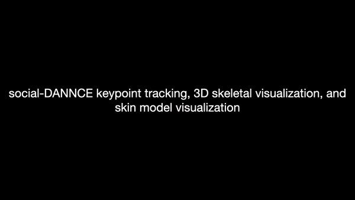

# s-DANNCE: Mapping the landscape of social behavior
Social interaction is integral to animal behavior. However, we lack tools to describe it with quantitative rigor, limiting our understanding of its principles and neuropsychiatric disorders, like autism, that perturb it. Here, we present a technique for high-resolution 3D tracking of postural dynamics and social touch in freely interacting animals.

2024/09: Preprint is available at [bioRxiv](https://www.biorxiv.org/content/10.1101/2024.09.27.615451v1).

## Installation
Please refer to [INSTALL.md](./INSTALL.md) for installation instructions.

## Demo Usage
Please refer to [DEMO.md](./DEMO.md) for basic usage of the codebase.

## Tips for Network Training
See [GUIDE.md](./GUIDE.md).