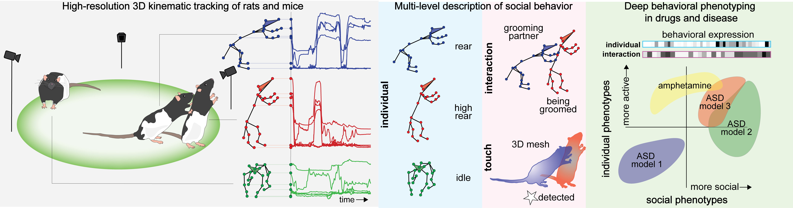

# s-DANNCE: Mapping the landscape of social behavior

<p align="center">
  
</p>

Social interaction is integral to animal behavior. However, we lack tools to describe it with quantitative rigor, limiting our understanding of its principles and neuropsychiatric disorders, like autism, that perturb it. Here, we present a technique for high-resolution 3D tracking of postural dynamics and social touch in freely interacting animals. Published in [*Cell* (2025)](https://www.cell.com/cell/fulltext/S0092-8674(25)00154-0). 

<p align="center">
  
</p>

## :rocket: Getting Started
### :wrench: Local Installation
Clone the repository
```
git clone https://github.com/tqxli/sdannce.git
cd sdannce
```

Then follow [INSTALL.md](./INSTALL.md) for finishing the environment setup. Note that s-DANNCE has only been tested on Linux.

### :star2: Quickstart Demo
Please refer to [DEMO.md](./DEMO.md) for a quick navigation through this codebase.

In addition, we have prepared notebooks for the following basic tasks:
- [Visualize multi-view dataset and Label3D annotations](./notebooks/1.visualize_mv_dataset_annotations.ipynb)
- [Inference using pretrained models](./notebooks/2.inference_using_pretrained_model.ipynb)
- [Finetune on new dataset](./notebooks/3.finetune_on_new_dataset.ipynb)

## :rat: Social Behavioral Database :mouse2:
Together with this codebase, we have released a large-scale [**social behavioral database**](https://dataverse.harvard.edu/dataverse/socialDANNCE_data) collected from 6-camera lone and social recordings across 80 animals, which includes WT rats and mice, rat amphetamine dosing experiments, and within-litter comparison of multiple ASD rat genotypes. 

This database includes >140 million 3D keypoint poses annotated by s-DANNCE, individual and social behavior classes acquired from [**SocialMapper**](https://github.com/uklibaite/SocialMapper), the multi-scale behavioral mapping method described in the paper, and recording metadata. The SocialMapper codebase is linked to the current repository as a submodule.

## :name_badge: License
This project is licensed under [CC-BY-4.0 Attribution](./LICENSE). 

## :books: Citation
If you use s-DANNCE, SocialMapper, and/or the social behavioral database, please cite:

> **Klibaite, U.**\*, **Li, T.**\*, Aldarondo, D., Akoad, J.F., Ölveczky, B.P. and Dunn, T.W., 2025. Mapping the landscape of social behavior. *Cell*. 

**BibTex**
```bibtex
@article{klibaite2025mapping,
  title={Mapping the landscape of social behavior},
  author={Klibaite, Ugne and Li, Tianqing and Aldarondo, Diego and Akoad, Jumana F and {\"O}lveczky, Bence P and Dunn, Timothy W},
  journal={Cell},
  year={2025},
  publisher={Elsevier}
}
```
